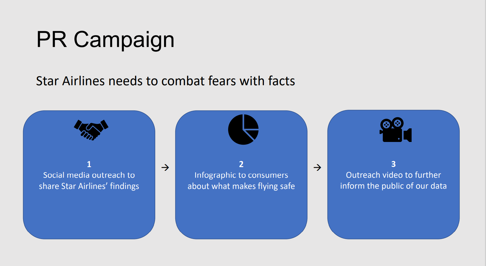
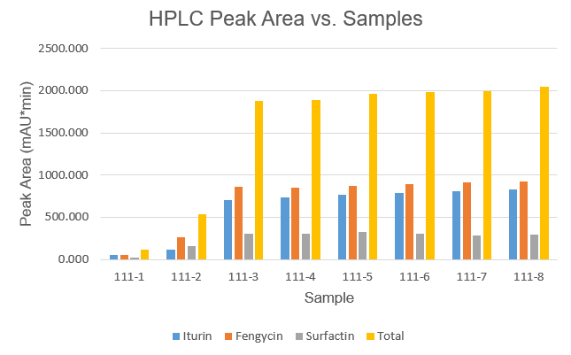
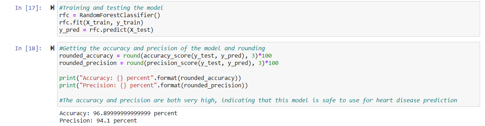

# About

[LinkedIn](https://www.linkedin.com/in/bilal-k-363433a2/) | [GitHub](https://github.com/bkudaimi/Project-Portfolio/)

My name is Bill Kudaimi and I am a data scientist with domain expertise in regression, classification, deep learning, data analytics, and visualization. I am passionate about helping humanity through coding projects. Whether it be machine learning algorithms, desktop applications, or just exploratory data analysis, I want to leave a positive impact on the world! 

# Projects

#### The following are 10 projects I have completed in the past in both programming and machine learning.

#### Each project has the following naming scheme: PROJECT_PURPOSE
###### PROJECT specifies what the project was for (application, model, presentation, etc). 
###### PURPOSE provides a short snippet of what was accomplished.
###### Note: Application files contain descriptions of their input and output.

Application_ReturningWeather: This application returns current weather data for any location specified by the user.

Application_SortingBiologicalData: This application sorts data in HPLC files specified by the user and outputs the data as graphs of protein concentration per sample over time.

ExecutiveSummary_PRCampaign: This summary presents a proposal to executives of an airline to adopt a PR campaign that would alleviate negative press caused by a crash.

Model_ClassifyingDigits: This classifier identifies the names of written numbers as a type of machine-learning-driven OCR (optical character recognition).

Model_ClassifyingFlowers: This neural network classifier analyzes pictures containing flowers and identifies the species of flowers.

Model_PredictingDeliveryStatus (Parts 1-4):  This model identifies which deliveries from an online retailer will be late so the retailer can remedy the problem accordingly.
 
Model_PredictingEmissions: This regression model predicts the amount of CO2 emissions from new motor vehicles to ensure government compliance.

Model_PredictingGraduateAdmissions: This model predicts the probability of an international student to gain admission to an American graduate school.

Model_PredictingHeartDiseaseRisk: This model predicts which patients will develop heart disease within a certain time frame to save lives and reduce diagnosis costs.

Model_PredictingMovieRatings: This model predicts the IMDb rating for new films allowing directors to focus on films predicted to be good ones.

Visit my GitHub repository for the files named here.

# Pictures

#### Selected pictures of my work

# Contact

###### I can be reached at bkudaimi@gmail.com for any questions/comments about my work.
